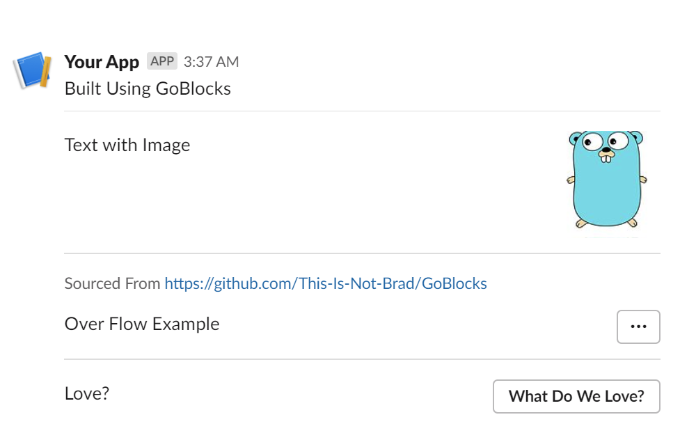

# GoBlocks

Install Library
```bash
go get github.com/This-Is-Not-Brad/GoBlocks
```


Example Usage

```Go

package main

import (
    "fmt"

    blocks "github.com/This-Is-Not-Brad/GoBlocks"
)

func main() {

	Blocks := []blocks.Blocks{
		blocks.GenerateSection("Built Using GoBlocks"),
		blocks.GenerateDivder(),
		blocks.GenerateSectionWithImage("Text with Image", "https://ih0.redbubble.net/image.520470450.9907/flat,128x,075,f-pad,128x128,f8f8f8.u4.jpg", "Google Logo"),
		blocks.GenerateDivder(),
		blocks.GenerateContext("Sourced From https://github.com/This-Is-Not-Brad/GoBlocks"),
		blocks.GenerateOverFlow([]string{"Some", "Overflow", "Values", "!!"}, "Over Flow Example"),
		blocks.GenerateDivder(),
		blocks.GenerateMultiSelect([]string{"Slack", "Blocks", "Cake", "World Peace"}, "Love?", "What Do We Love?"),
	}

	body := blocks.GenerateBlocksString(Blocks)

	fmt.Println(body)

}
```

Will generate the following Blocks for posting to Slack.

